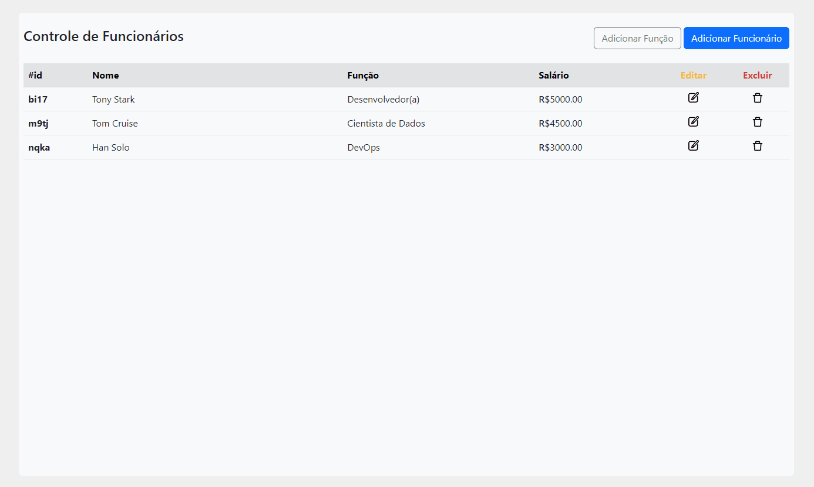
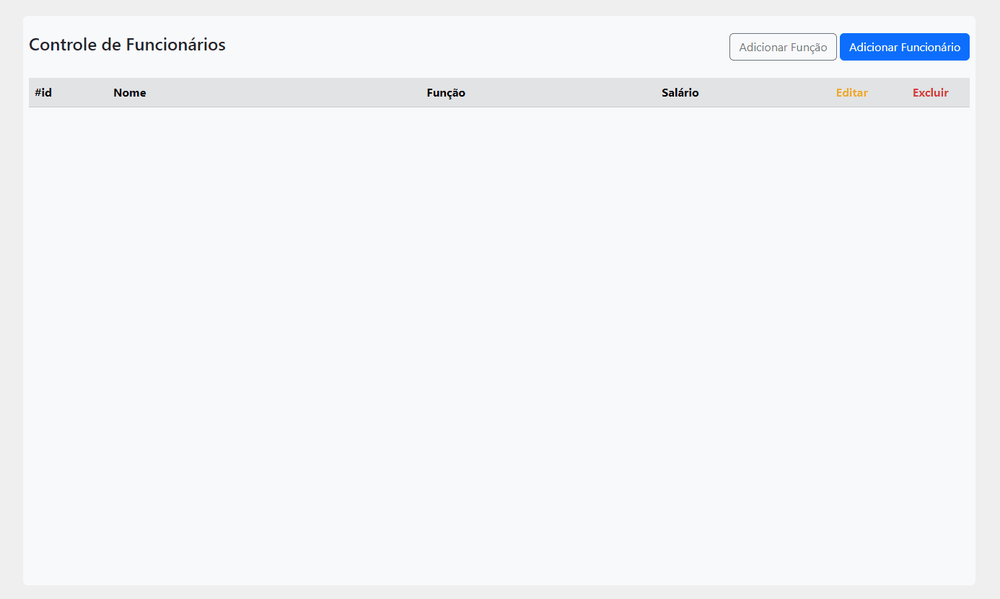
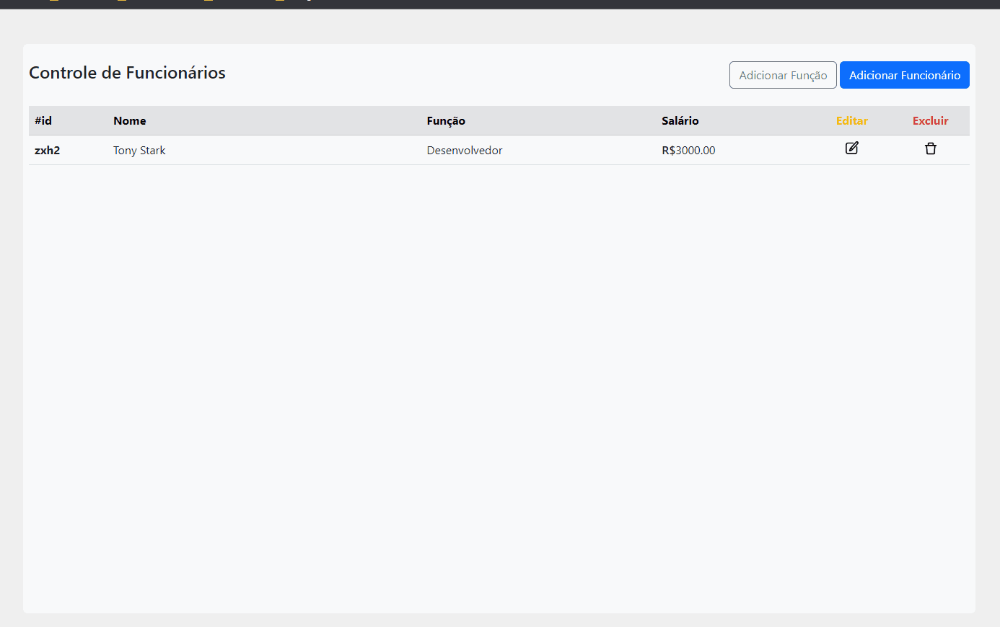
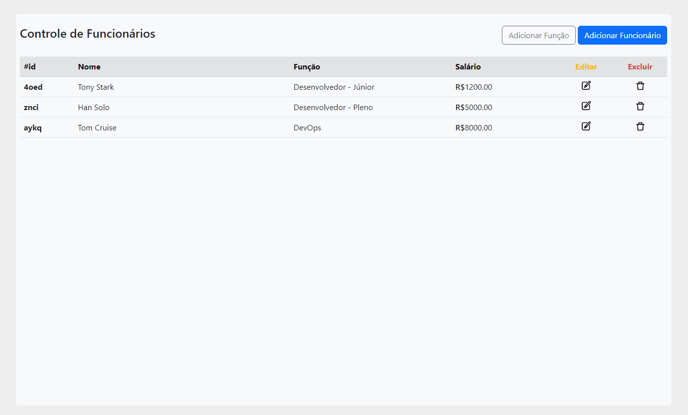

# Sistema Para Controle de Funcionários
<link rel="stylesheet" href="https://cdn.jsdelivr.net/gh/devicons/devicon@v2.15.1/devicon.min.css">

## 👀 Visão Geral

Sistema de CRUD para o gerenciamento dos funcionários de uma empresa.


## ⚙️ Ferramentas
- <i class="devicon-nodejs-plain colored"></i> Node.js
- <i class="devicon-bootstrap-plain colored"></i> Bootstrap
- <i class="devicon-javascript-plain colored"></i> Javascript
- <i class="devicon-html5-plain colored"></i> HTML5
- <i class="devicon-css3-plain colored"></i> CSS3
---
## 👨‍💻 Como Utilizar
Para testar esse projeto em seu desktop basta seguir os seguintes passos:
```bash
#Clone o projeto
git clone https://github.com/viniciusg23/crud-nodejs.git
```

```bash
#Vá até o diretório criado
cd crud-nodejs/src
```

```bash
#Instale as dependências usando npm
npm install
```

```bash
#Execute o script App.js usando node
node App.js
```
Após esses passos você basta abrir seu navegador que o projeto estará rodando na porta 3000 do localhost

- **http://localhost:3000/**
---
## 🔍 Funcionalidades
Como um CRUD, esta aplicação possui as funcionalidades de criação, leitura, atualização e remoção de funcionários e cargos. Para adicionar um novo funcionário, é necessário a criação de um cargo posteriormente para ser associado com o novo empregado, exceto se o cargo já tenha sido criado em outro momento.

1. **Criação de Cargos e Funcionários**
    
    Vemos aqui a necessidade de criar um cargo antes de adicionar um novo funcionário, já que no formulário do novo empregado existe um select com todos os cargos cadastrados para ser selecionado.

1. **Remoção de Cargos e Funcionários**
    
    Para excluir um cargo existente, deve-se antes remover todos os funcionários que possuírem esse cargo, se não, haverá um erro e não será possível excluir o cargo desejado.

1. **Atualização de Funcionários**
    
    Pode-se editar qualquer funcionário a qualquer momento, e as alterações que poderão ser feitas é o cargo e salário.

## 👋 Considerações Finais
Este foi um projeto com a intenção de melhorar meu entendimento e habilidade nas tecnologias utilizadas. Além disso, para complementar o meu portfólio no github.
Nesta aplicação, por ser um projeto de pequena escala, não é utilizado banco de dados, todos os dados são salvos localmente no servidor. Para ver projetos desse tipo, procure nos repositórios:
- Novos Repositórios em breve...

## 📜 Créditos
_Projeto Realizado Por:_ [Vinícius Gonzaga Guilherme](https://www.linkedin.com/in/vin%C3%ADcius-gonzaga-guilherme-9a65a722a/)

> ### Contate-me
> - <i class="devicon-linkedin-plain colored"></i> [LinkedIn](https://www.linkedin.com/in/vin%C3%ADcius-gonzaga-guilherme-9a65a722a/)
> - viniciusgonzagaguilherme@gmail.com
          
          
          

